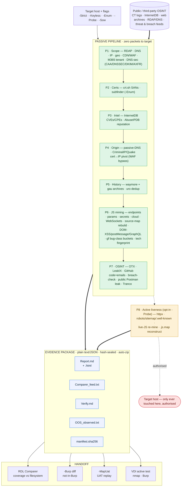

<p align="center">
  <picture>
    <source media="(prefers-color-scheme: dark)" srcset="assets/logo-dark.svg">
    
  </picture>
</p>

<p align="center">
  <b>Passive reconnaissance for a single internet-facing host. Zero packets to the target.</b>
</p>

<p align="center">
  
  
  
  
  
</p>

<p align="center">
  <a href="#architecture">Architecture</a> •
  <a href="#quick-start">Quick start</a> •
  <a href="#commands--flags">Commands</a> •
  <a href="#what-it-collects">Collects</a> •
  <a href="#output">Output</a> •
  <a href="#api-keys">Keys</a>
</p>

---

**AssetLens** is a PowerShell-native passive-recon collector for a **single internet-facing host**. It maps the target's external attack surface entirely from third-party sources — **zero packets to the target** — and writes a self-contained, hash-sealed evidence package (plain text / JSON) plus a ranked worklist. The one exception is the opt-in **`-Probe`** phase (P8), which liveness-checks discovered URLs and needs target authorization.

## Architecture

Public sources feed seven passive phases (P1–P7); the sealed package hands off to your coverage and active-testing tools. Only the opt-in `-Probe` phase (P8) ever touches the target.



> **Legend** — 🟩 passive, zero packets · 🟨 opt-in active `-Probe`, authorised only · 🟥 the target · 🟦 outputs.

## Quick start

```powershell
git clone https://github.com/impramodsargar/AssetLens.git
cd AssetLens
.\Invoke-AssetLens.ps1 -Setup                           # toolchain (restart shell if Go/Python were just installed, then: -Setup -SkipBase)
Copy-Item .\config\keys.example.ps1 .\config\keys.ps1   # optional — free keys widen coverage
.\Invoke-AssetLens.ps1 app.target.com                   # run
```

The **keyless core** (RDAP, crt.sh, Shodan-InternetDB, web archives, LeakCheck, M365) runs with zero keys. Output lands in `output\<host>_<date>\`, auto-zipped + SHA-256'd. `config\keys.ps1` is git-ignored — never commit real keys.

## Commands & flags

| Command | What it does |
|---|---|
| `Invoke-AssetLens.ps1 <host> [-Probe] [-Sow <n>]` | **RECON** → package + `Report.md` + auto-zip |
| `... -Setup [-SkipBase]` | install the toolchain |
| `... -Validate` | preflight every key + tool (hits providers + benign IPs, never a target) |
| `... -Report -Package <dir>` | rebuild `Report.md` — pure-local |
| `... -Zip -Package <dir> [-Sow <n>]` | (re)zip for transfer; `-Sow` names it `citiva_<n>.zip` |
| `... -Diff -Package <new> -Against <old>` | diff two scans → `Diff.md` |
| `... -Package <dir> -Burp <urls.txt>` | feed vs Burp sitemap → `discovered_not_in_burp.txt` |
| `... -MapUat -Package <dir> -UatBase <url>` | replay discovered URIs onto a UAT host |
| `... -Package <dir> -Phase P5,P6 [-Probe]` | re-run phase(s) on a package, no re-discovery |

| Flag | Effect |
|---|---|
| `-Strict` | no DNS resolution at all — IP only from passive-DNS APIs |
| `-Keyless` | ignore `keys.ps1`; run no-key sources only |
| `-HttpOnly` | HTTP core only — skip external CLI tools |
| `-Enum` | opt-in subdomain enum (`subfinder`) — wildcard / multi-host scope only |
| `-Probe [-Rate 15]` | **ACTIVE** liveness on the target host — authorised only. DoS-safe: 1 req/URL, rate-limited, no fuzzing |
| `-Sow <n>` | name the zip `citiva_<n>.zip` — Citi VA deliverable convention |

## What it collects

| Phase | What it pulls (all third-party / passive) | Keys |
|---|---|---|
| **P1 Scope** | RDAP · DNS (MX/SPF/DMARC/NS/CNAME) · IP · geo · CDN/WAF · netblock owner · **M365 / Azure AD tenant** · **DNS security** (CAA · DNSSEC · DKIM selectors · **AXFR** zone-transfer attempt per NS) | keyless |
| **P2 Certs** | crt.sh SANs (in-scope flagged) · `subfinder` (`-Enum`) | keyless |
| **P3 Intel** | Shodan-InternetDB **CVEs/CPEs** · AbuseIPDB reputation *(ports left to the in-VDI nmap scan)* | keyless |
| **P4 Origin** | passive-DNS (VirusTotal · SecurityTrails) · **CriminalIP / Quake cert→IP pivot** (WAF bypass) · Netlas | keyed |
| **P5 History** | `waymore` + `gau` archives (Wayback · CommonCrawl · OTX · URLScan) · `uro` dedup | keyless |
| **P6 JS mining** | endpoints · params · wordlist · cloud assets · **WebSockets** · secrets (`trufflehog`/`gitleaks`/`jsluice` + custom patterns) · `retire.js` vuln-libs · Wappalyzer fingerprint · **source-map reconstruction** · jsluice AST **API map + DOM-XSS/postMessage/GraphQL deep pass** · **gf-style bug-class buckets** (xss/sqli/ssrf/lfi/redirect/rce/ssti/idor) | keyless core |
| **P7 OSINT** | AlienVault OTX · LeakIX · GitHub code + commit-emails · LeakCheck breach-check · **public Postman leak** (keyless; searches Postman's public collections for the target domain, surfaces only in-scope requests + leaked auth/keys) · Tranco · SpiderFoot | mixed |
| **P8 Live** *(`-Probe`, active)* | `httpx` liveness · robots / sitemap / `.well-known` · live-JS re-mine · `.js.map` reconstruct → `08_live\` | active |

Missing a tool or key? That step logs `SKIP` and the run continues — coverage scales with what you have installed.

## Output

```
output/<host>_<date>/
  Report.md · Report.html   readable brief + dashboard: historical-vs-live coverage, [LIVE] endpoint provenance, prioritised (READ FIRST)
  Comparer_feed.txt         deduped in-scope URLs → your coverage tool (Burp-vs-RDL)
  Verify.md                 ranked worklist of next checks
  OOS_observed.txt          off-host assets, flagged DO NOT TEST
  manifest.sha256           integrity / chain-of-custody   (+ auto .zip + .zip.sha256)
  01_scope … 07_osint · 08_tech/   per-phase readable outputs (raw JSON in each _raw/)
  08_live/                  only with -Probe: live URLs · well-known · live JS + API map
```

Everything is plain text / JSON — usable with nothing but a text editor. **`Comparer_feed.txt`** drops straight into a coverage tool to diff discovered-vs-tested; `-Burp <urls.txt>` runs that diff locally → `discovered_not_in_burp.txt`. **`06_js\gf\`** buckets in-scope param-URLs by likely bug class (`xss/sqli/ssrf/lfi/redirect/rce/ssti/idor`) so you test the parameter, not just the path.

## API keys

All **free-tier** and **optional** — the keyless core already covers RDAP, crt.sh, InternetDB, archives, LeakCheck and M365. Add keys only to widen coverage:

- **P3** AbuseIPDB · **P4** VirusTotal · SecurityTrails · Netlas · CriminalIP · Quake · **P5** URLScan · **P7** GitHub · LeakIX · AlienVault OTX

Sign up at each provider's account/API page, paste into `config\keys.ps1`, and run `.\Invoke-AssetLens.ps1 -Validate` to live-check them.

## Scope discipline

The target is **one host**. Everything else the tools surface — SANs, subdomains, co-hosted siblings, passive-DNS neighbours — is auto-written to `OOS_observed.txt` as **OUT OF SCOPE, DO NOT TEST**, never into the active worklist.

<details>
<summary><b>Notes &amp; troubleshooting</b></summary>

- **Keys** live in `config\keys.ps1` (git-ignored). Ship only `keys.example.ps1`; rotate any key that ever lands in a log.
- **PowerShell, not Git Bash** — avoids MSYS path-mangling of slash args; HTTP via `Invoke-RestMethod`.
- **Tech fingerprint** — a slimmed, MIT-licensed Wappalyzer ruleset (`config\wappalyzer.json`) matched **passively** against archived bodies; header/JS-only techs (Shopify, Next.js) are invisible this way by design.
- **Extending** — each phase is a `PhaseN-*` function; write into the matching `0N_` folder and call `Add-OOS` for anything off-host.
- **"running scripts is disabled" / "…is not digitally signed"** — PowerShell's ExecutionPolicy plus the downloaded-file (**Mark-of-the-Web**) block on a script pulled from a GitHub zip. Fix it once:
  ```powershell
  Get-ChildItem -Recurse .\ | Unblock-File          # clear the "downloaded from internet" flag
  Set-ExecutionPolicy -Scope CurrentUser RemoteSigned
  ```
  Or run a single invocation past the block with no system change:
  ```powershell
  powershell -NoProfile -ExecutionPolicy Bypass -File .\Invoke-AssetLens.ps1 -Setup
  ```
  In a signed-script shop, **code-sign** `Invoke-AssetLens.ps1` and it runs clean under RemoteSigned. If a GPO scope (`MachinePolicy` / `UserPolicy`) enforces the policy (`Get-ExecutionPolicy -List`), that overrides all of the above — involve IT or use an unmanaged box.
- **A tool reads `MISSING` after `-Setup`** — PATH needs refreshing: open a new shell, run `-Setup -SkipBase`, then `-Validate`. (`waymore` / `uro` install via pip; on a bleeding-edge Python use 3.12 for prebuilt wheels.)
- **jsluice** — the AST JS analysis (API map + deep pass) is built from source with cgo, so `-Setup` installs a C compiler (WinLibs mingw, via winget) to build it. On a locked-down box without winget, install any C compiler, then `CGO_ENABLED=1 go install github.com/BishopFox/jsluice/cmd/jsluice@latest`.
- **Never** point a hosted online scanner at the target — that is active-by-proxy and leaks the asset.

</details>
